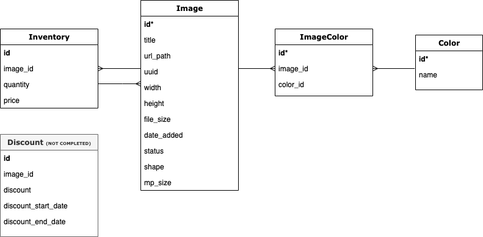

# 📸 Image Repository

The Image Repository created is an REST API that let's program talk to each other and exposes the image and inventory information.

# Prerequisites

Make sure you have installed all the following prerequisites on your development machine:

- Python 3.x
- Pip
- Postgres

# 🚀 How to Use the APIs & Launch

1. Clone this repository

```
$ git clone https://github.com/nancyyeh/image_repo
```

2. Set up an environment using requirements.txt file

```
$ pip install -r requirements.txt
```

3. Run seed.py to set up database and dummy image data

```
$ python3 seed.py
```

4. Run server.py to launch

```
$ python3 server.py
```

5. To easily reach the API endpoints use tools such as postman

# 💭 Design Decisions

- Data Structure
  
- Price is set in cents to avoid float end problems - can use front end to convert cents to dollars

# 🤖 API Endpoint to...

- Search Images on:
  - keyword term used in image title (Input: string)
  - colors in the image (Input: list of colors - black, white, yellow, orange, pink, red, purple, blue, green, and brown)
  - orientation/shape of the image (Input: list of shapes - landscape, portrait, and square)
  - min and max file size in bytes (Input: integer in bytes)
  - size of the image in megapixel (Input: string - small(4-12MP), medium(12-24MP), large(24MP+))
- Inventory Management
  - Create an inventory record for the image
  - Update the inventory record for the image
  - Get the inventory details of one specific image
  - Get the inventory details of all images
  - Sold item (e-commerence endpoint) - update inventory record

# API Details

| URL                            | Methods            | Descriptions                                                                                                                                          | Fields                                                                                                                                                                                                                                                               |
| ------------------------------ | ------------------ | ----------------------------------------------------------------------------------------------------------------------------------------------------- | -------------------------------------------------------------------------------------------------------------------------------------------------------------------------------------------------------------------------------------------------------------------- |
| /api/search                    | GET                | Get search results based on search critera                                                                                                            | term - string<br>shapes - list/array (landscape, portrait, square)<br>min_file_size - integer<br>max_file_size - integer<br>mp_size - string (small, medium, large)<br>colors - list/array (black, white, yellow, orange, pink, red, purple, blue, green, and brown) |
| /api/images                    | GET                | Get all image details                                                                                                                                 | -                                                                                                                                                                                                                                                                    |
| /api/images/<image_id>         | GET                | Get image details on a specific image                                                                                                                 | image_id - integer                                                                                                                                                                                                                                                   |
| /api/inventory/<image_id>      | GET / POST / PATCH | Get inventory information on a specific image<br>Create inventory information on a specific image<br>Update inventory information on a specific image | image_id - integer<br>quantity - integer<br>price - integer (in cents)                                                                                                                                                                                               |
| /api/inventory/sell/<image_id> | POST               | Update inventory once an item is sold                                                                                                                 | image_id - integer<br>quantity_sold - integer                                                                                                                                                                                                                        |

# 🖥️ Tech & Materials

- Python
- Flask
- SQLAlchemy
- Jinja
- Postgres Database
- Dummy Images from pexels

# 🛠️ Future Improvements

- Add tags on image and ability to search and filter by tags
- Search on image height and width
- Implement discount, discounting period and return discounted price
- Secruity with authorization and permission on making changes with using API
